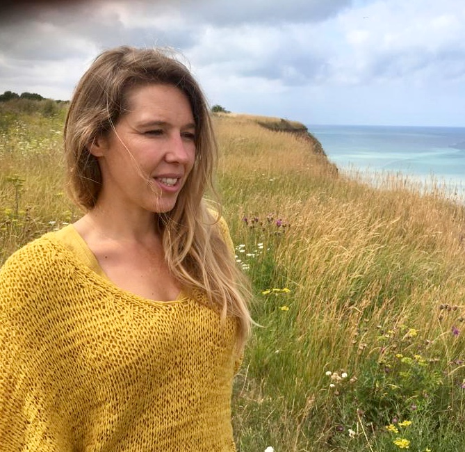

Biodanza Brugge is opgericht door Fien Morel en Lieven Clement met het oog om Biodanza mee de wereld in te zetten in Brugge.

### Fien Morel 
```{r echo=FALSE,out.width="40%",out.extra='style="float:left; padding:10px"'}

```

Mijn eigen leef- en groeitraject is een grote bron van inspiratie in het begeleiden van mensen. Ik ben getrouwd met Lieven en mama van 3 kinderen die als waardevolle spiegel elke dag een grote inspiratie bron zijn.  

In 2018 kwam ik voor het eerst in contact met Biodanza. Sindsdien heeft het me niet meer losgelaten en voel ik de nood om dit mooie cadeau te delen. Ik volg de vier jarige Biodanza opleiding aan de [Biodanza school Antwerpen](https://www.biodanzaschoolantwerpen.be/). In mijn laatste jaar ben ik actief als Biodanza-docent-onder-supervisie van Annette Heynderickx en heb ik mijn eigen [wekelijkse Biodanza groep](./activiteiten.html) in Brugge.  

Dans en beweging zijn al van kindsbeen af aanwezig in mijn leven en dan ook niet meer weg te denken. Ik vind het heerlijk om mensen te begeleiden in het vinden van de dansende/bewegende stroom ‘in hun lichaam’. Ik ben al jaren bezig met lichaamswerk, dans, beweging en yoga. Ik gaf al zijnsdans in groep en crea-atelier aan kinderen. Ik volgde creatieve therapie bij VSPW/Balans met als optie dans- en bewegingstherapie en een 2 jarige opleiding lichaams-gecentreerde dynamische therapie bij TOUCHhelps. Een verrijking om via massage, beweging, lichaamslezen, ademhaling, spierspanning en -ontspanning … de weg naar lichaamsbewustzijn te laten groeien waardoor het algemeen welbevinden een boost krijgt en het inzicht duidelijker wordt.  

Ik geef les in BUSO Ravelijn en begeleid jongeren met een mentale beperking via Biodanza & Sherborne. Ik volgde de erkende Bach consulentenopleiding in De Walnoot in Brasschaat en werk als Bach consulent erkend door de Dr. Edward Bach Foundation Engeland in mijn praktijk [n-zicht](https://www.n-zicht.be). 

</br>

### Lieven Clement

```{r echo=FALSE,out.width="40%",out.extra='style="float:left; padding:10px"'}
knitr::include_graphics("./figs/lieven.jpg")
```

 Ik ben getrouwd met Fien, vader van 3 kinderen en werk als Professor in Statistische Genomica aan de [Universiteit Gent](https://www.ugent.be) waar ik de [statOmics](https://statomics.github.io/) groep leid. Mijn groep focust zich op de ontwikkeling van statistische methoden en open source tools voor differentiële transcriptomics en proteomics data analyse waarbij we respectievelijk genen en eiwitten wensen te vinden die anders tot expressie komen tussen groepen van planten, dieren of mensen (b.v. man $\leftrightarrow$ vrouw, ziek $\leftrightarrow$ gezond, en ook meer complexe vergelijkingen).  
 
Mijn leef- en groeitraject wordt gestuurd door mijn gezin, mijn passie voor wetenschappen en het lopen van de work-life balans.
Als gepassioneerde hoofdmens is het een uitdaging om geaard te blijven en ook mijn lichaam voeding te geven. En met Fien is Biodanza zomaar mijn leven binnengewandeld.  

Sinds 2018 neem ik deel aan een wekelijkse Biodanza groep en dat heeft me terug laten aankomen bij mezelf in het hier en nu. Het is een lab waarin ik mag oefenen in afstemmen, met mezelf, met de ander en met het groter geheel. Toen ik me wat meer in Biodanza ben gaan verdiepen, mocht ik ontdekken dat het een systeem is dat gestoeld is op een sterke wetenschappelijke basis. Het liet mijn passie voor het voelen, emoties, muziek en wetenschap voor het eerst samenkomen. Met Biodanza komen hoofd en hart helemaal samen. In 2021 ben ik dan ook met veel passie gestart met de Biodanza opleiding aan de [Biodanza school Antwerpen](https://www.biodanzaschoolantwerpen.be/). 

