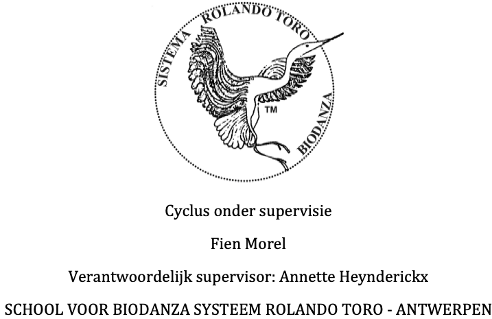

 

Lichaamstaal is even belangrijk en soms belangrijker dan gesproken taal.   
Het luisteren naar ons lichaam laat ook toe om ons bewust te worden van gevoelens en emoties, en ze te erkennen. 

<!--Onze lichaamshouding vertelt veel over ons levenspad. Door de gebeurtenissen, contacten, onze leefomgeving, de aandacht en liefde die we krijgen, gaat ons lichaam een bepaalde houding aannemen. Deze houding voelt vertrouwd aan. Sommige facetten in onze houding en lichaamstaal die ooit zijn ontstaan vanuit bescherming en toen zinvol waren, kunnen later onze groei, levensvreugde en omgeving (on)bewust beïnvloeden. Je meer bewust worden van je lichaamshouding kan er dan ook voor zorgen dat je zowel fysiek als emotioneel je plek kan innemen op een manier die goed voelt voor jou en anderen, dicht bij jezelf, in je midden.-->

Biodanza maakt gebruik van de kracht van muziek, dans en beweging in groep om tot een beleving (vivencia) te komen. Dat brengt positieve veranderingsprocessen op gang die door kunnen werken in ons dagdagelijkse leven. Jezelf en de ander ontmoeten staat in Biodanza centraal. Om tot een beleving te komen is het belangrijk dat we ons veilig voelen in de groep. We staan open voor elkaar zonder oordeel.

Biodanza is Gym voor je hele zijn en

- laat je opnieuw verbinden met jezelf, de anderen en het universum,
- het verbetert de algemene energie en stimuleert je organisme en cellen zich opnieuw te vernieuwen, 
- inspireert je om warmte en affectiviteit opnieuw in de wereld te zetten, en,
- laat je weer voeling krijgen met je oorspronkelijke manier van zijn.

Biodanza is een pad naar de vreugde van het leven.

Het systeem Biodanza werd gecreëerd door Rolando Toro Araneda uit Chili, voormalig hoogleraar expressie psychologie aan de Universiteit van Chili. Rolando Toro haalde inspiratie uit de antropologie en de gedragsbiologie. De theoretische achtergronden van Biodanza werd gevonden in de biologie: de wetenschap van het leven.

[Wekelijkse Groep Biodanza](./activiteiten.html)  

[Getuigenissen](./getuigenissen.html)

 

{width=50%}

