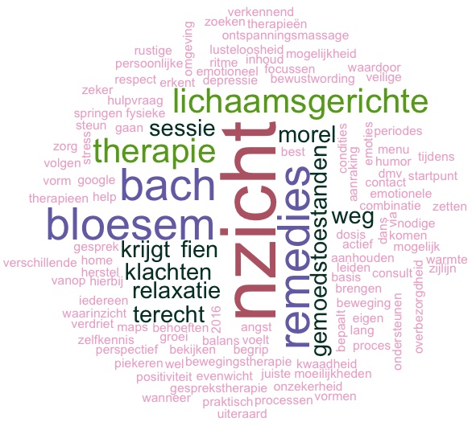

Bij n-zicht kunnen volwassenen, kinderen en adolescenten terecht voor een persoonlijk consult en ondersteuning bij levensvragen.
Vanuit haar professionele achtergrond heeft [Fien Morel](./about.html) ook veel ervaring met het begeleiden van mensen met een mentale beperking.
Via [Bach Bloesem Remedies](./bachbloesems.html) en [Aanrakings-, Dans- en Bewegingstherapie](./lichaamsgericht.html) gaan we samen op zoek naar inzicht, klaarheid en kracht.

 

n-zicht biedt ondersteuning bij
angst, stress, depressie en burn-out,
twijfel, onzekerheid, overbezorgdheid,
verdriet, teleurstelling, onverdraagzaamheid, kwaadheid,
lusteloosheid, piekeren, slaapproblemen,
conflict hantering, traumaverwerking,
gezin- en relatieproblemen, ...

Tijdens het therapeutisch proces ontwikkel je
lichaamsbewustzijn en lichaamsbesef, een positiever zelfbeeld, zelfvertrouwen en assertiviteit;  
en leer je je bewust worden van gevoelens en emoties, emoties en traumatische ervaringen delen en verwerken, patronen en denkbeelden bijsturen, veranderen of versterken,
grenzen erkennen, aangeven en bewaken, speelsheid, motivatie en creativiteit stimuleren.

Je kan bij n-zicht ook terecht voor een [ontspanningsmassage en relaxatie](./relaxatie.html) en [wekelijkse Biodanza groepen](https://biodanzabrugge.be/activiteiten.html).

[Consult](./consult.html)?  
Hoe verloopt een [sessie Bach Bloesem Remedies](./bachbloesemsessie.html)?  
Hoe verloopt een [sessie Lichaamsgerichte Therapie](./lichaamsgericht.html)?  
Hoe verloopt een [sessie Relaxatie](relaxatie.html)?